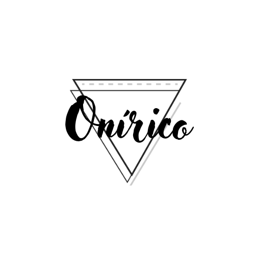

# Godoy-Onirico
## Asistencia neuronal
### Servicio de asistencia neuronal para revivir un recuerdo, vivir un sueño o despedirse con un final feliz

#### Temática del e-commerce
Se me ocurrió comenzar con una página ficcional para poder dejar fluir la imaginación y no
usar los ejemplos de páginas conocidas que me terminen cerrando la posibilidad de inventar.
Esta página se trata de un **servicio de asistencia neuronal** 
La historia es de un servicio que comenzó para la tercera edad, permitiendo conectar a los 
canales neuronales de los clientes y generar un sueño a elección, en el que puedan sentirse
de la edad que deseen y cumplir alguna meta antes de fallecer. Poco a poco se abren
las posibilidades con esta tecnología y el interes del público de todas las edades para soñar o 
recordar momentos felices, ser capaces de vivir un momento único.

#### Público objetivo
el Público objetivo es cualquier persona mayor de 18 años *(por seguridad)* 

#### Tipografía Principal

https://fonts.google.com/specimen/Source+Code+Pro?query=source+code

Se eligió esta tipografía como principal para los textos de la página. 

#### Paleta de colores

https://colorhunt.co/palette/1b243051557e816797d6d5a8

Se eligió esta paleta de colores buscando ir con tonalidades oscuras con ***acento armónico***, para simular lo onírico, de ensueño, si se quiere cósmico.

#### Creación de logo

El logo representa el nombre de la empresa, con adorno de estilo minimalista y geométrico.

#### Diseño FIGMA

En el siguiente link se encuentra el diseño en FIGMA con diferentes wireframes para fuente, componentes, mobile (Home, Detail product, Login, Register, Carrito) y Desktop (Home, Detail product y Carrito).

https://www.figma.com/file/YMansilQnPn66n5YarDT6u/BOCETOS-PARA-ECOMMERCE-(Copy)?node-id=3%3A362